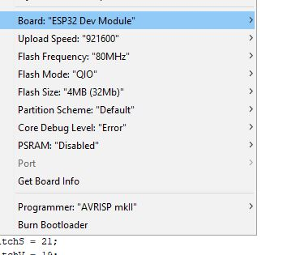

# Convert a sit\stand desk to an ESP32 MQTT controlled motorised desk

A project to convert a manually "Cranked" desk into one driven by a motor and controlled through MQTT commands. This opens the door to control the desk through mobile apps or home automation systems.

For hardware used and more information see [here](https://talha.me/2019/02/11/adding-a-motor-and-mqtt-control-to-a-sit-stand-desk/)

Youtube demo
[](https://www.youtube.com/watch?v=RYZCJe3wubs "Youtube video Demo")

## Installation

Use the Arduino IDE to open the desk.ino file amd upload to the ESP32 with the settings below.



1. The only changes that should be required are the variables marked in "desk.ino" with comments.

2. Rename credentials_example.h to credentials.h 

3. Fill out credentials.h

4. Wire according to diagram.jpg. If the wiring is changed then you will need to change the pins and code on the ESP32 as required.

5. Upload code through Arduino IDE


When the system boots on for the first time it will check if there is a match on the magic number in setupDesk.ino > setupDesk(). If it fails to find the defined "magicChar",  it will go through the boot cycle, 


* Log on to wireless
* Log onto MQTT server
* Read EEPROM for magic number
* Broadcast last position or cycle bot to top to check motor and start in "Top" position
* Store "cycleTime" and position data in EEPROM
* Wait for MQTT inTopic


```C++
define EEPROM_SIZE 64                        /* EEPROM size put aside for ESP32, adjust if you add any additional EEPROM storage paramaters*/ 

int maxMotorTime = 32000;                     /* Maually set  max bot to top cycle time for safety. Set as millis, 1000 = 1 sec*/
int deskTimer = 0;                            /* MQTT incoming time */
char magicChar[2] = "Q";                      /* magic charachter to check if EEPROM numbers have been stored before last shutdown, can be change to any character of your choice*/
int safeTopTime = (int)maxMotorTime *.9;      /* Set a buffer from the top - default 10%*/
int safeBotTime = (int)maxMotorTime *.1;      /* Set a buffer from the bot  - default 10%*/
const byte motor1Pin1 = 16;                   /* Motor Controller Pin 1*/
const byte motor1Pin2 = 17;                   /* Motor Controller Pin 2*/
const byte motor1Pin3 = 5;                    /* Motor Controller Pin 3*/
const byte motor1Pin4 = 18;                   /* Motor Controller Pin 4*/

const byte botLimitSwitchS = 19;              /* Bot End Stop Pin*/ 

const char* outStatus = "/Desk/status";       /* change the MQTT topic for updating the status Topic which is 3 for top and 4 for bot, 1\2 up\down */
const char* outPerc = "/Desk/perc";           /* change the MQTT topic for updating the status percentage */
const char* outDebug = "/Desk/debug";         /* change the MQTT topic for updating the debug information */
const char* inTopic = "/Desk/cmd";            /* change the MQTT topic for updating the commands to the desk through MQTT*/

const int eepMagicChar = 0, eepDeskStatus = 10, eepCycleTime = 20, eepDeskPosinMilli = 30, eepDeskPosP = 40; /* Eeprom memory storage locations */
                                              
                                              /* To be implemented , top endstop, button controls */
/*stateTopS = HIGH*/
const byte buttonPinUp = 4; 
const int buttonPinDown = 15; 
/*byte buttonStateUp = 0;   
byte buttonStateDown = 0
*/
```


## Usage
#### Payload format 
It expects a payload in the form of "X,YYYY". If payload is larger than maxMotorTime, it gets changed to maxMotorTime as a layer of safety.

X = [1-7]
 
YYYY  = timing payload where 2000 == 2 seconds.


X is used as follows
* 1 - Move desk UP
  * (expected payload: 1,1000 . Payload would move desk UP 1 second)
* 2 - Move desk DOWN
  * (expected payload: 2,1000 . Payload would move desk DOWN 1 second)
* 3 - Move desk TOP
  * (expected payload: 3,XXXX . Payload would move desk to TOP position, XXXX is ignored)
* 4 - Move desk BOTTOM
  * (expected payload: 3,XXXX . Payload would move desk to BOTTOM position, XXXX is ignored)
* 5 - Move desk % based 
  * (expected payload: 5,88 . payloadwould move to 88% of max height)
* 6 - Print DEBUG information
  * (Update EEPROM and status information to MQTT topic "outDebug")
* 7 - RESET EEPROM
  * (Reset data stored in EEPROM including magicChar)
* 8 - Set ERROR mode
  * (to be updated)

#### magicChar
magicChar[2] = "Q"; 

Default is Q but can be changed to any Char. Boot checks for this Char and either sets cycleTime or reads from the EEPROM and outputs to "outDebug" topic and "outStatus" topic.

#### outStatus
Outputs to MQTT topic what position desk is in [1-4]

#### outPerc
Outputs to the MQTT topic what position desk is in as a percentage of max height [1-100]

#### outDebug
Desk outputs debug and status information to the MQTT topic. 

#### inTopic
Desk waits for a payload to arrive on the MQTT "inTopic" . 


## TO DO
* Configure buttons
* Configure LCD 2 * 16 
* Configure top end stop
* Implement memory cycling 
* Fix OTA updates

## License
[GNU](https://www.gnu.org/licenses/gpl-3.0.en.html)
